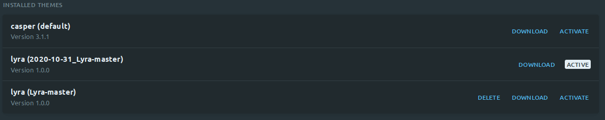

# Lyra

A paid-members publication for Ghost. Can be used with no code knowledge required.

# Installation instructions

1. [Download this theme](https://github.com/TryGhost/Lyra/archive/main.zip)
2. Log into Ghost, and go to the `Design` settings area to upload the zip file
3. Unzip the theme archive on your computer and locate the file called `routes.yaml`
4. Inside Ghost admin, go to the `Labs` settings area and scroll down until you see the `Custom Routes` section
5. Upload the `routes.yaml` from this theme

That's it! You now have a Ghost publication which supports free and paid memberships. If you need help, check out the <a href="https://ghost.org/docs/members/">Ghost members documentation</a> or chat with other Ghost users on <a href="https://forum.ghost.org">Ghost forum</a>.


# Upgrade instructions

1. [Download this theme](https://github.com/TryGhost/Lyra/archive/refs/heads/main.zip) and rename the zip for ease of identification in Ghost later.  For example `2022-10-20_Lyra-main.zip`
2. Log into Ghost, 4. go to the `Labs` settings area and scroll down until you see the `Routes` section
3. Download your current `routes.yaml` file 
4. Next go to the `Design` settings area and click `Change Theme` at the bottom of the navigation pane
5. Click the `Upload theme` button in the top right and upload the zip file you downloaded and renamed earlier (for example `2022-10-20_Lyra-main.zip`)
6. You will now see two instances of Lyra similar to the screenshot below
    
7. Ensure your new Lyra theme is active (based on the renamed zip from earlier, `lyra (2020-10-31_Lyra-main)` in the screenshot)
8. Delete the previous Lyra theme (`lyra (Lyra-master)` in the screenshot)
9Upload `routes.yaml` as required (see _Installation instructions_ above)

# Development

Styles are compiled using Gulp/PostCSS to polyfill future CSS spec. You'll need [Node](https://nodejs.org/), [Yarn](https://yarnpkg.com/) and [Gulp](https://gulpjs.com) installed globally. After that, from the theme's root directory:

```bash
# Install
yarn

# Run build & watch for changes
$ yarn dev
```

Now you can edit `/assets/css/` files, which will be compiled to `/assets/built/` automatically.

The `zip` Gulp task packages the theme files into `dist/<theme-name>.zip`, which you can then upload to your site.

```bash
yarn zip
```

# PostCSS Features Used

- Autoprefixer - Don't worry about writing browser prefixes of any kind, it's all done automatically with support for the latest 2 major versions of every browser.
- Variables - Simple pure CSS variables
- [Color Function](https://github.com/postcss/postcss-color-function)


# Copyright & License

Copyright (c) 2013-2022 Ghost Foundation - Released under the [MIT license](LICENSE).
